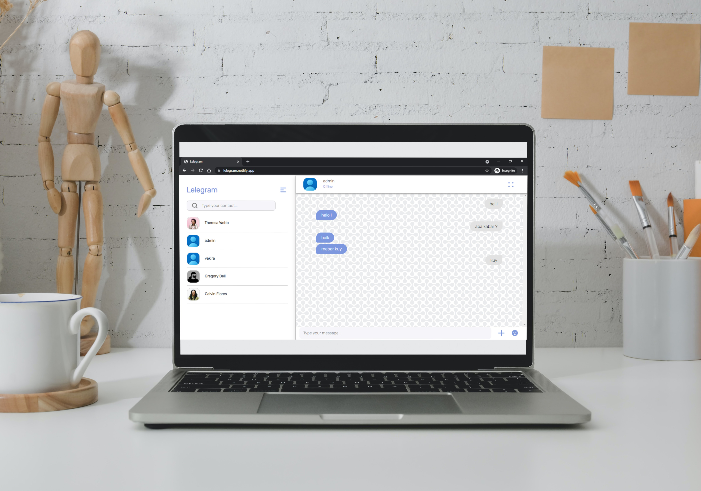

<h1 align='center'>React JS - Lelegram</h1>
  <p align="center">
    <a href="https://lelegram.netlify.app">View Demo</a>
    ·
    <a href="https://github.com/rifqiziyad/front-end-realtime/issues">Report Bug</a>
    ·
    <a href="https://github.com/rifqiziyad/front-end-realtime/pulls">Request Feature</a>
  </p>



## About The Project

This is a chat website with realtime using Socket.Io.

## Built With

[](https://github.com/facebook/react)
[](https://github.com/react-bootstrap/react-bootstrap)
[](https://socket.io)

## Requirements

1. <a href="https://nodejs.org/en/download/">Node Js</a>
2. Node_modules `npm install` or `yarn install`
3. Backend API Lelegram [`here`](https://github.com/rifqiziyad/back-end-realtime)

## Getting Started

1. Download this Project or you can type `git clone https://github.com/rifqiziyad/back-end-realtime.git`
2. Open app's directory in CMD or Terminal
3. Type `npm install` or `yarn install`
4. Add .env file at root folder project

```
REACT_APP_BACKEND_URL = localhost:3003/backend3/api/v1/
```

5. Type `npm run serve`

## Acknowledgements

- [React](https://reactjs.org/)
- [React Bootstrap](https://react-bootstrap.github.io/)
- [Axios](https://www.npmjs.com/package/axios)
- [redux](https://redux.js.org/)
- [socket.io](https://socket.io/)

## License

© [Rifqi Ziyad Imtinan](https://github.com/rifqiziyad)
